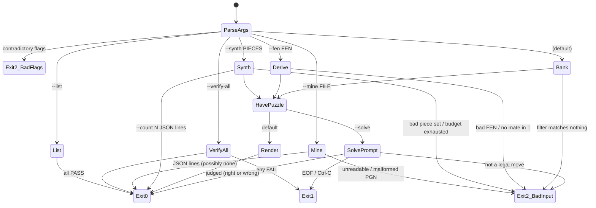

# App Flow — ChessPuzzleForge CLI

**Date:** 2026-08-03 · **PRD:** [PRD.md](PRD.md) · **TDD:** [TDD.md](TDD.md)

> There is no GUI. The interactive surface is `chesspuzzleforge/cli.py` — an
> argparse front end plus one genuinely interactive mode (`--solve`, which
> reads a move from stdin and judges it). "Screen" below means a terminal
> state; every transcript and exit code here was produced by running the
> command, not read off the source.

## Entry points

There is exactly one: a shell.

```
python -m chesspuzzleforge [flags]     # the documented form; no install needed
chesspuzzleforge [flags]               # console script, if the package is installed
```

Nothing links here, nothing redirects here, there is no session and no state
carried between runs. Two invocations with the same argv produce the same
output — and with `--seed`, byte-identically.

## Mode dispatch (and its precedence)

`main()` validates flag combinations first, then picks **exactly one** mode, in
this fixed order. The order matters because it is silent: the first match wins
and later flags are simply not consulted.

| # | Mode | Trigger | Produces |
|---|---|---|---|
| 0 | **Reject** | contradictory flags | `parser.error`, exit 2 |
| 1 | **List** | `--list` | one line per bank puzzle |
| 2 | **Verify** | `--verify-all` | PASS/FAIL per bank puzzle |
| 3 | **Mine** | `--mine FILE` | JSON lines (stdout) + progress (stderr) |
| 4 | **Synthesize** | `--synth PIECES` | one rendered puzzle, or `--count N` JSON lines |
| 5 | **Derive** | `--fen FEN` | one rendered mate-in-1 from that position |
| 6 | **Bank** | *(default)* | one rendered puzzle, filtered by `--goal`/`--difficulty` |

Modes 4–6 all end at a *puzzle*, which is then either rendered or handed to
`--solve`.

## The happy path

The default run — no flags, no file, no network:

1. **Draw.** A puzzle is chosen from the bank (seeded by `--seed` if given) and
   re-verified with the engine before anything is printed.
2. **Render.** Header (id, theme, goal, side to move), the ASCII board from the
   mover's perspective, the FEN.
3. **Withhold.** Without `--reveal`, the footer reads
   `(Run again with --reveal to see the solution.)` — the one and only nudge.
4. **Exit 0.**

```
$ python -m chesspuzzleforge --goal mate_in_1 --seed 5 --reveal
Puzzle: m1-queen-escort
Theme:  queen-and-king mate
Goal:   Mate in 1  (White to move)

  +------------------------+
8 | . . . . . . k . |
...
1 | . . . Q . . . . |
  +------------------------+
    a b c d e f g h

FEN: 6k1/8/6K1/8/8/8/8/3Q4 w - - 0 1

Solution: Qd8#  (UCI: d1d8)
```

The interactive path adds two steps between 2 and 4:

```
$ python -m chesspuzzleforge --seed 0 --solve
[board rendered, solution withheld]

Enter your move as SAN (e.g. Qd8#) or UCI (e.g. d1d8):
> Qh3
Correct! forces mate in two.
```

The prompt accepts **either** notation: `_read_move` tries `parse_san` first,
then `move_from_uci`, and both check legality in the actual position.

## Every state of every mode

The template's six web states map onto a CLI as: normal output · nothing to
show · bad input · interrupted · slow · and the machine-readable variant. All
six are real here.

| Mode | Normal | Nothing to show | Bad input | Interrupted | Slow |
|---|---|---|---|---|---|
| **List** | 10 lines, id / goal / theme, exit 0 | cannot occur — the bank is a module constant, never empty | n/a | SIGINT kills it; nothing was written | instant |
| **Verify** | `PASS` per puzzle + `All puzzles verified.`, exit 0 | n/a | n/a | as above | < 1 s |
| **Mine** | JSON lines on **stdout**, progress on **stderr**, exit 0 | `Mined 0 verified puzzles.` on stderr, no stdout lines, **exit 0** — an empty or tacticless PGN is a valid answer, not an error | unreadable file → `Cannot read PGN file: …`, exit 2; malformed movetext → `Mining failed: game 1: move 4 ('Kd4') does not name a legal move: …`, exit 2 | partial stdout may already be flushed; nothing on disk | ~0.3 s for a 33-ply game; `--max-games`/`--max-plies` bound it |
| **Synthesize** | rendered puzzle, or `--count N` JSON lines + `Synthesized N verified puzzles.` on stderr, exit 0 | budget exhausted → `Synthesis failed: no mate_in_2 found in KNK after 2000 samples (found 0 of 1); try a different seed, a larger max_tries, or a stronger piece set`, **exit 2** | `Synthesis failed: invalid piece set 'KPK': unsupported piece(s) P; use Q, R, B or N …`, exit 2 | as above | seed- and depth-dependent; `--tries` is the bound, not the clock |
| **Derive** | rendered mate-in-1, exit 0 | no mate in the position → `No mate-in-1 found in that position.`, **exit 2** | `Invalid FEN: …`, exit 2 | instant | instant |
| **Bank** | rendered puzzle, exit 0 | filter matches nothing → `no puzzles available for goal 'mate_in_1' at difficulty 'hard'`, **exit 2** | argparse rejects unknown `--goal`/`--difficulty` values, exit 2 | instant | instant |
| **Solve** | `Correct! delivers checkmate.`, exit 0 | n/a | unparsable or illegal move → `'zzz' is not a legal move here. Try SAN (Qd8#) or UCI (d1d8).` on stderr, exit 2 | EOF or Ctrl-C → `No move entered.`, **exit 1** | instant |

**Stream discipline.** Puzzle data goes to stdout; progress, summaries and
errors go to stderr. `python -m chesspuzzleforge --mine games.pgn > mined.jsonl`
therefore yields a clean JSON-lines file while the human still sees progress.
This is checked by the CLI tests, not just intended.

**Exit codes.** `0` success · `1` "the run completed but the answer is no"
(a bank puzzle failed `--verify-all`; no move was entered at the solve prompt)
· `2` bad input or an unsatisfiable request. Note deliberately: a **wrong but
legal** answer in `--solve` exits **0**. Getting a puzzle wrong is not a tool
failure.

## Transitions



Every path in that diagram terminates in an exit code. There is no loop, no
retry and no state to be stuck in.

## Permissions

None. No accounts, no roles, no sessions, no revocation — the process runs as
whoever invoked it and can read exactly the files that user can read. The
template's "access revoked while the user is on the screen" question has no
analogue and is not answered here rather than answered vacuously.

## Dead ends

None found. Every terminal state prints a message that names the next action:
a bad piece set lists the accepted letters, an exhausted budget names three
different remedies, an illegal move restates both accepted notations, an
unfiltered empty pool names the goal *and* the difficulty that produced it, and
a withheld solution names the flag that reveals it. Nothing says "something
went wrong", and nothing suggests retrying an operation that cannot succeed on
a retry.

## Known rough edges

Recorded here rather than quietly fixed, because this document is
retrospective and the rename that prompted it was documentation-only.

1. **Silently ignored flags.** `main()` is explicitly fail-loud about some
   combinations (`--max-games` without `--mine`, `--count` without `--synth`,
   `--difficulty` with `--synth`) but silent about others in the same block.
   `--list --solve` prints the list and drops `--solve`; `--fen … --goal
   mate_in_2 --difficulty hard` prints a **mate-in-1** puzzle, exit 0, with
   neither flag honoured and no warning. Given how loud the neighbouring
   checks are, the silence is an inconsistency, not a policy.
2. **The solve hint gives away the answer.** `_cmd_solve` appends
   "Hint: the key move is by the piece on f1" — but the message it appends to
   already reads `Not the solution: does not force mate in two (a forcing move
   is f1h3)`, because `verify_solution` composes its own failure hint. The
   first wrong guess therefore prints the full solution in UCI, which defeats
   the mode's purpose.

## Accessibility

The relevant floor for a terminal program, and it is met:

- **ASCII only.** No Unicode chess glyphs, no box-drawing characters, no
  emoji. Output is legible under any code page and speaks correctly through a
  screen reader; nothing depends on East-Asian-width handling.
- **No colour, ever** — so colour is never the only signal, trivially. Status
  is carried by words (`PASS`/`FAIL`, `Correct!`, `Not the solution`).
- **No cursor control, no spinners, no rewritten lines.** Every line printed
  stays printed, which is what makes the output readable in a pipe, a log, a
  CI transcript, and a braille display.
- **Keyboard only by construction.** The single interactive prompt reads one
  line from stdin; Ctrl-C and EOF are both handled and both exit cleanly with
  a message rather than a traceback.
- **Machine-readable path available.** Anyone who cannot use the ASCII board
  can take the JSON (`--mine`, `--synth --count`) or the FEN printed with every
  puzzle and render it however they like.

**Caveat, pinned by measurement:** the ASCII board's borders are 28 columns
wide while its rank rows are 21, so the right-hand border does not line up with
the right edge of the board. It is cosmetic and it does not affect the JSON or
the FEN, but it is wrong, it is visible in the README's own example, and it is
recorded in the Design Brief rather than hidden.
